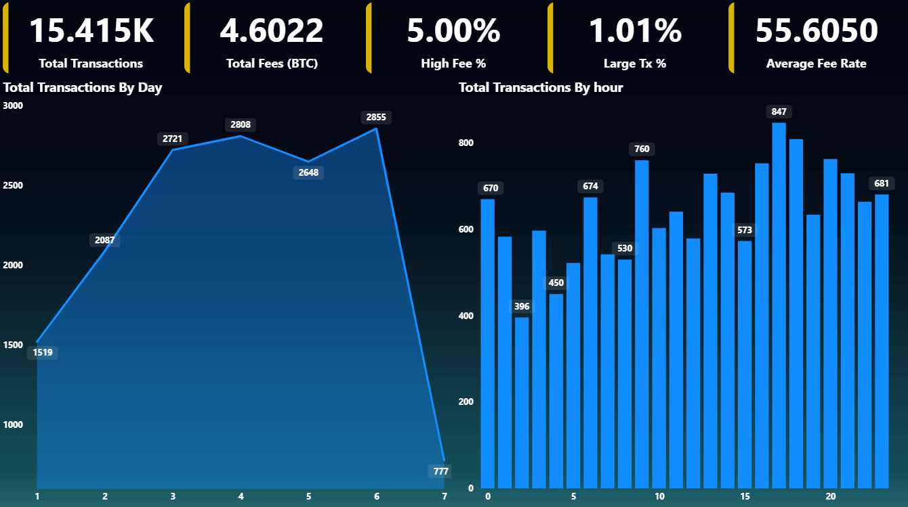
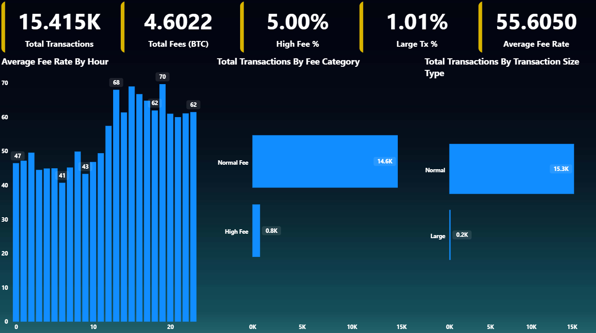
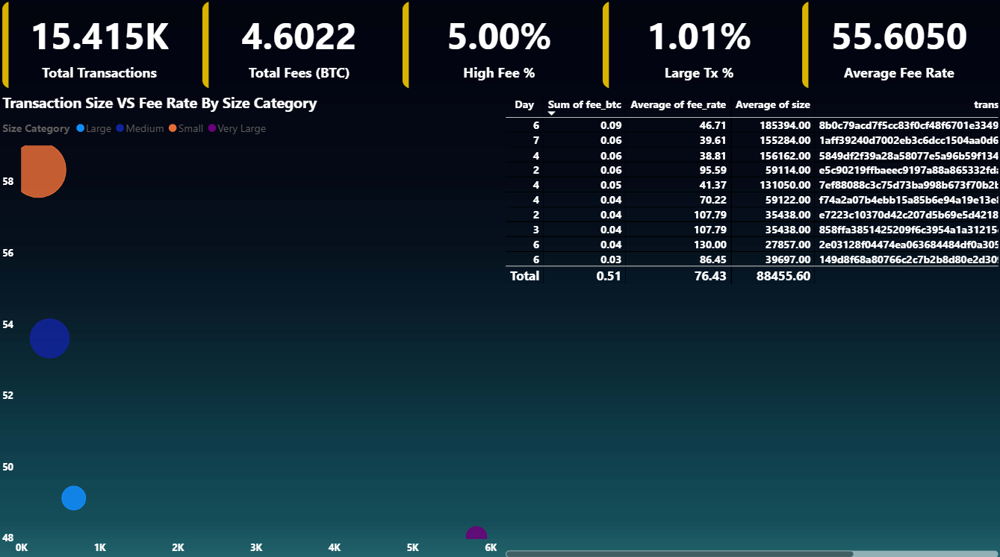

# Bitcoin Transaction Analytics (FinTech Data Analyst Project)

## Project Overview

This project analyzes Bitcoin blockchain transactions to understand network congestion, fee behavior, and transaction efficiency.

The goal is to simulate a real-world FinTech analytics workflow using:

- Python for data cleaning and feature engineering
- PostgreSQL for analytical queries
- Power BI for dashboard visualization
- BigQuery public dataset as the data source

## Dataset

Source:
BigQuery Public Dataset – Bitcoin Transactions

Table used:
bigquery-public-data.crypto_bitcoin.transactions

Sample size:
15,000 transactions

## Data Pipeline

BigQuery → Python Processing → PostgreSQL → Power BI Dashboard

## Features Engineered

- Fee rate
- Hour of transaction
- Large transaction flag
- High fee flag
- Input and output value in BTC

## Key KPIs

- Total transactions
- Total network fees
- Average fee rate
- Large transaction percentage
- High fee transaction percentage

## Dashboard Insights

Key findings include:

- Small transactions pay higher fees per byte
- Transaction congestion varies significantly by hour
- Large transactions achieve better fee efficiency

## Tools Used

Python (Pandas)
PostgreSQL
Power BI
Google BigQuery

## Dashboard Preview

## Author
Prajwal Sonekar
